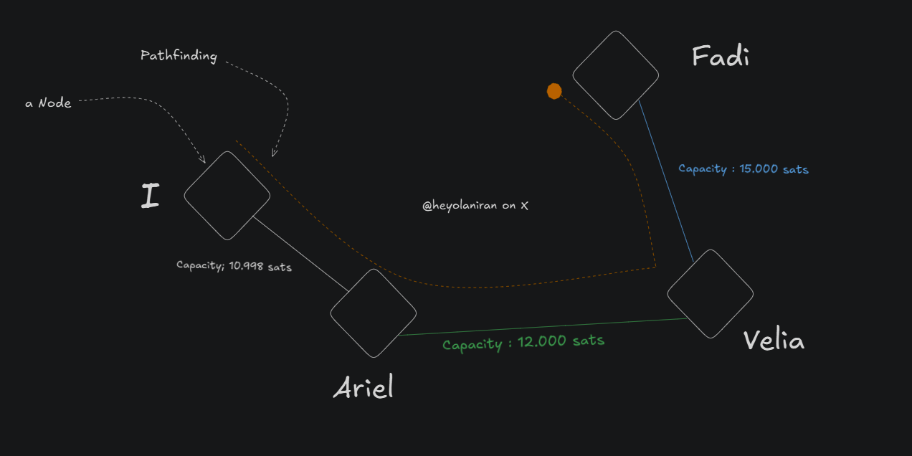
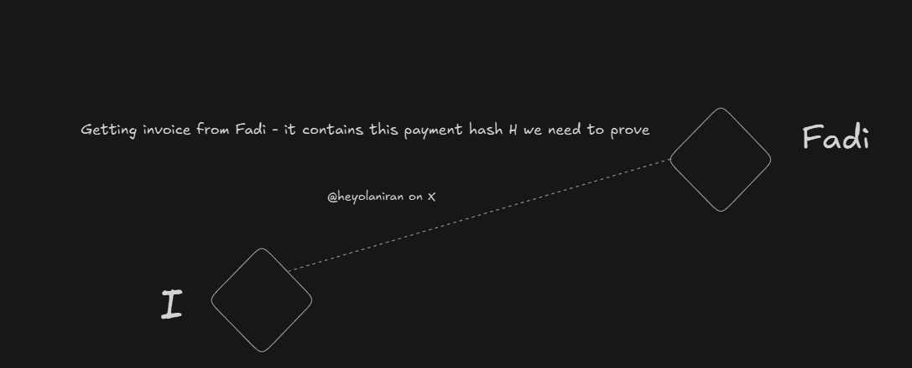
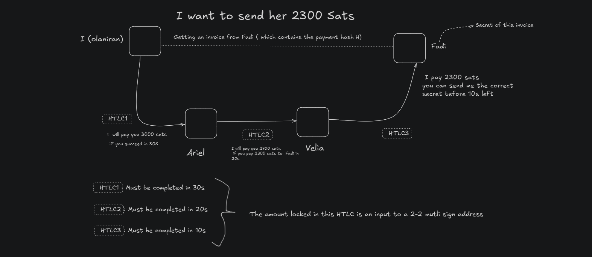
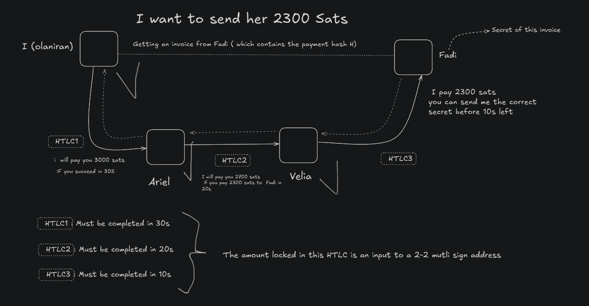
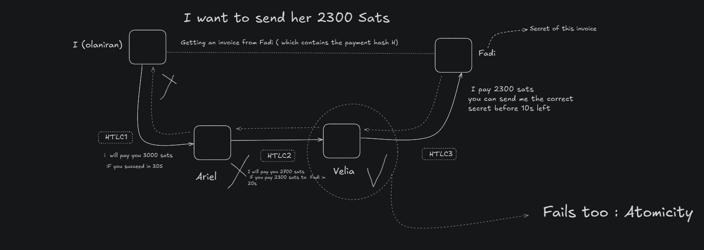

# Hash Timelocked Contract (HTLC) 

    Hello guys, welcome to my first topic in Lightning Protocol Development. 
    In this topic, we will be discussing Hash Timelocked Contract (HTLC).

## What is a HTLC ?
A hash Timelocked contract is basically a contract between two entities (nodes) in the lightning Network. This contract says: 

If you are able to prove me you made a payment of `X satoshis` with  a secret which hashes to this `Hash`  before `X unit of time` , you can spend this `Y >= X satoshis`, otherwise , i'll get back my funds. 

Lets take an example to understand this better.  
Lets say i want to send 2300 sats to Fadi but i do not have openned channel with here.

I have openned channel with Ariel and have `10_998 sats` as channel capacity.  By the `path finding` algorithm, i found the shortest path to Fadi through Ariel.

Our actual configuration looks like : 




## How HTLC works in that configuration ?  
To send some sats ton Fadi I need to get from hern an invoice may be through her blog or when she sent it to me. The invoice will contain the following information: `amount`, `hash` and `expiration`.



Let's focus on the `hash` part. The hash is a hash of the secret which will be used to prove the payment.

Since i use this route whe found by pathfinding, we will call itt now `routed payments` with route designed by : `I-> Ariel-> Velia-> Fadi` 

I need to make a contract with Ariel to send 2300 sats to Fadi that says : 
    
    if he is able to prove he successfully made this action before 30s left he can spend the 3000 sats we both signed in 2-of-2 multisig address, otherwise i will get back my funds.

In his turn , `Ariel` will sign a contract with `Velia` to send `2300 sats to Fadi` and if she is able to prove she successfully made this action before `20s left` she can spend the `2700 sats` they both signed in 2-of-2 multisig address, otherwise Ariel will get back his funds.

Then `Velia` will sign a contract with `Fadi` that says : 

    You can spend the `2300 sats` we both signed in 2-of-2 multisig address if you give me the secret which hashes to `hash` before `10s left` otherwise i will get back my funds.  



## HTLC Successfull case : 
Once we have established an HTLC between Fadi and an intermediate node, Velia in our case, if Fadi give his secret (unique) for this payment hash to Velia before the expiration time, she will be able to spend the `2300 sats`. She successfully received our satoshis.  

In his turn , Velia will give the secret to Ariel before the expiration time, he will be able to spend and so on...  `We are moving backward with the secret from Fadi to I`.




## HTLC Failure case :
For any reasons, if some node are unable to succeed his HTLC contract, primarly : 

- Every Node will get back his own funds 
- And all HTLC fails that make the payment fail too.  


```
This is the Atomicity of the HTLC. If one node fails to complete the HTLC, the entire payment fails.
```



## Do I need to trust the following nodes ?
No, you don't need to trust the nodes in the path. The HTLC is a trust mechanism, due to the 2-of-2 multisign address you lock in the funds, your partner can not spend your funds without your validation.

As Lightning is a punishment-based system, cheaters risk losing their entire fund in the payment channel used.  

    HTLC ensure trustless in that way.  

## What do participants gain ?  

Remenber that the HTLC is a mechanism to ensure the payment is atomic. The participants gain the following :
- **Security** : The payment is secure, if one node fails to complete the HTLC,
- **Atomicity** : The payment is atomic, if one node fails to complete the HTLC
- **Trustless** : The payment is trustless, you don't need to trust the nodes

And if you remember well , `the Y amount in the understanding of HTLC definition is gte amount they have to send. So they do not loose money.`

They can be rewarded by some extra sats we will call here - Some routing fees.  

