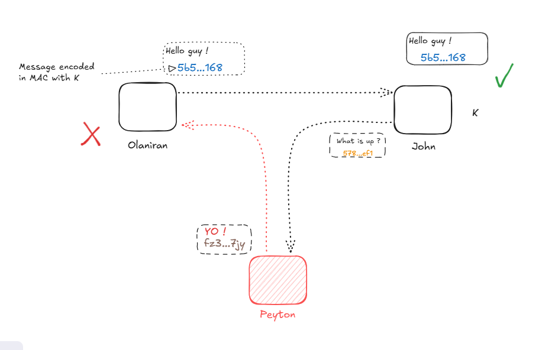

# Where MAC and HMAC are implemented in the Lightning Protocol ? and Why ? 

    Here we will discuss about implementation for MAC in HMAC in lightning node communications and why they are so important.  

## Where MAC and HMAC are implemented in the Lightning Protocol ?

Let's start with the basics first 

### What is MAC and HMAC ?

MAC stands for (Message Authentification code).  It is a tag we will use to essentially prove that the message we are sending is authentic - not altered - and that it came from the right sender.
MAC is a one-way function, meaning that it is easy to compute the MAC of a message, but it is hard to compute the message from the MAC. 

Let's take an example without and with MAC 

- *Without Mac*

    In this context , we have two nodes Olaniran and John. Since we have openned channel, we have a way to communicate between us.  Actually `Olaniran` can send message to John and, he can respond back to `Olaniran`.

    Our current configuration looks like : 

    

    In this case ,  we are exposed to rewritting when an attacker node can intercept the message and rewrite it.  This is a problem because we can't be sure if the message is authentic or not. 

    

- *With MAC*

    To prevent this, we are going to add a kind of tag to the message. This tag is called MAC (Message Authentification Code).

    
    
    
    But another problem remains: how do we ensure that we pass the message and the K key in the right order so that our partner can verify the authenticity and integrity of our message? 

    Since ` MAC(message , key)` is different of `MAC(key, message)` we have to define a order to create the MAC Tag.  

     

    At this point, we can introduce `HMAC, which is a MAC implementation based on hashed functions`. 

    HMAC is now here to provides uses : 
        
    - More privacy 
    - Involve message integrity and authenticity
    - Involve key integrity and authenticity

## Why and Where ? 
    From this we can conclude that MAC and HMAC are essentially used to prove the authenticity of communications and messages between nodes. 

    In Lightning it covers: 

    - Message transports 
    - Onion Routing 
    - Payment channels ( Channel state)
    - Hashed Timelock Contract (HTLC)

