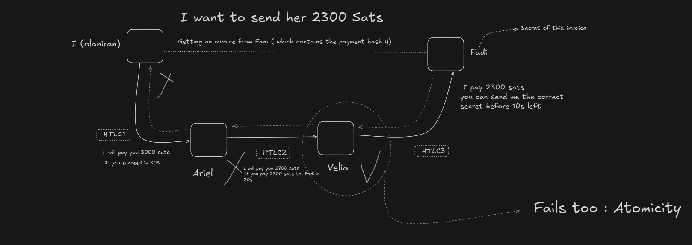

# Causes of routing failures in Lightning Protocol 

    This note are about possible causes of payments failure that can occur in Lightning Protocol.
    Some are more severe than others in terms of their impact on the network's functionality and user experience.

## Channel Disabled 

To make a payment in lightning Network we need a canal that we can use to transfer data between two or more partners (routing payments).
Since Lightning Protocol is hot system which requires all concerned nodes be online to process some operation (unlike Bitcoin) : 
```
The fact that (i.e in routing payment),
any channel can go offline during the payment can be a cause of failure in that payment processing.  
```


## Temporarly channel Disabled 

The temporaly Channel disable is similar with our previous cause : Channel Disabled, 
```
In this case its marked temporarly, so the node might be online as soon as possible and channel will be available again ( i.e Hardware Maintenancy)
```


## Permanent Node Failure 

This is the most severe failure in Lightning Protocol.  

```
Firsty, Lightning does'nt have explicit notion of wallet and backup. From this, for any reason, your node get down, there is a chance you could lost most of your funds.  

In another point of view , every others node that had a channel with you will see their funds locked in the channel for a certain time (to_self_delay property)

```


## Channel capacity Insufficient 

This is the most common source of failure in a payment channel.  


```
That means the channel doesn't have enough funds to proceed the payment
```

Let say we want to pay an 25_000 sats in invoice.  
We have openned channel with enough capacity `1_000_000 sats` with node B 
and Node B has oppenned channel with `20_000 sats` to our destination.  

`20_000 sats is less than 25_000 sats so Node B doesn't have enough satoshis to forward our payment to Node C`


## Incorrect Payment Details 

This is the current cause of payment failure between two people. 

```
It occurs when in payment - routing payment- channel , the recipient get the wrong hash or amount than ones expected
```

## Insufficient Payment fees 

The fees setted is not enough for a node to process a payment. This can be fix by increasing the fees for the payment 


## Expired HTLC 

In Lightning Network , Hash Timelocked Contract is one of most resilient protocol to handle a complex routing payment failure.  
```
If the payment is not processed before the HTLC timeout left , the payment fails and the funds is refounded to each owner in the routing payment system.  
```

You can read more about [HTLC here](hash-timelocked-contract-topic-001.md)




## Required Node Feature Missing 

This failure occurs when a payment requires a specific protocol feature that a node in the routing path doesn't support. 

The `Required Node Feature Missing` error in the Lightning Network is an important but relatively technical routing failure.

```
When a Lightning Network payment is being routed, it needs to pass through multiple nodes to reach its destination.
Each node might support different features or capabilities, as the Lightning Network protocol has evolved over time with various upgrades and improvements.
```

For example:

- Multi-part payments (MPP) require nodes to understand how to handle payment fragments
- HODL invoices require specific timelock handling
- TLV (Type-Length-Value) extension fields for additional payment data
- Anchor outputs for more flexible fee management
- Newer hash functions or cryptographic primitives

`This can be the result of incompabilities between the versions of lightning implemantation ran by nodes.`

